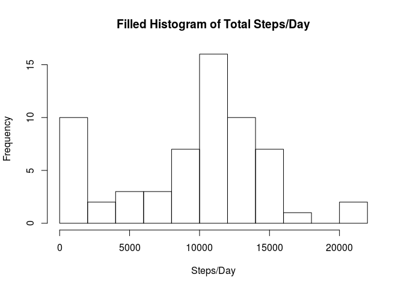

# Reproducible Research: Peer Assessment 1


## Loading and preprocessing the data
The data is provided in a zipfile, therefore it is necessary to unzip the csv file before reading it in, using the following commands. The data is stored in a dataframe named activity.


```r
unzip("activity.zip")
activity <- read.csv("activity.csv")
```

Also, since we will be doing some time series analysis  a variable known as datetime was created that represents the date and time as a POSIXct object.
This was more difficult than it might have seemed due to the naming convention of the intervals, which lists the starting minute for each interval, and appends the hour to the front. Therefore the first interval in the first hour is designated as the numeral 0, the last interval in the first hour is designated as 55, the first interval in the second hour is designated as 100, and the last interval in the second hour is 155. This is not easy to extract using the strp time function because the hours and minutes are not listed as decimal numbers such as "00" and indeed hours are not recorded at all for the "00" hour.

To resolve this problem, I made the interval variable a factor. By calling as.numeric on the interval factor, I created a vector with numbers 1-288, from which I subtracted 1. This vector corresponds to each of the 5 minute intervals in a day. I then used this vector to calculate the hour variable by multiplying each interval by five minutes, dividing by 60 and rounding down. I calculated the minutes variable by multiplying the interval vector by 5, and taking the modulus of 60. Finally, I  pasted the date, hour and minute together and created the datetime variable using as.POSIXct.


```r
activity$interval <- as.factor(activity$interval)
activity$hour <- floor((as.numeric(activity$interval)-1)*5/60)
activity$minute <- ((as.numeric(activity$interval)-1)*5)%%60
activity$datetime <- as.POSIXct(paste(activity$date,activity$hour,activity$minute,sep=":"),format="%F:%H:%M")
```


## What is mean total number of steps taken per day?
In order to more easily manipulate the data, the plyr and dplyr packages were loaded. It is then easy to create a histogram of the total number of steps taken per day and examine the distribution of step counts


```r
library(plyr)
library(dplyr)

steps.per.day<-ddply(activity,.(date),summarize, total=sum(steps,na.rm=TRUE))

hist(steps.per.day$total, main="Histogram of Total Steps/Day", xlab="Steps/Day",breaks=10)
```

 

It is also easy to compute some summary statistics about the number of steps taken in a day. For instance the mean and median numbers of steps per day are given by the code below.


```r
mean(steps.per.day$total)
```

```
## [1] 9354.23
```

```r
median(steps.per.day$total)
```

```
## [1] 10395
```

## What is the average daily activity pattern?

In order to figure out the average daily activity patterns, it is necessary to summarize the average steps per 5-minute interval for each 5 minute interval throughout the day. To do this, I used the hour and minute variables created earlier.  

**Note: This is the same as using the interval factor variable, but it allows me to create a POSIXct object and better label the x axis**


```r
steps.per.5min<-ddply(activity,.(factor(hour),factor(minute)),summarize, total=sum(steps,na.rm=TRUE))
names(steps.per.5min)[1:2] <- c("hour","minute")
interval<-as.POSIXct(paste(steps.per.5min$hour,steps.per.5min$minute,sep=":"),format="%H:%M")
plot(interval,steps.per.5min$total,type="l",main="Average Daily Activity Pattern", xlab="Time",ylab="Steps")
```

 

As you can see the maximum number of steps on average occurs in the 5 minute interval given by the following code.


```r
steps.per.5min[steps.per.5min$total== max(steps.per.5min$total),]
```

```
##     hour minute total
## 104    8     35 10927
```

Which is the interval that begins at 8:35 am.

## Imputing missing values
How many missing data values are there in the dataset?
By calculating the number of observations, and subtracting the number of complete observations it is possible to calculate the number of missing values.

```r
good <- complete.cases(activity)
numobs <- nrow(activity)
numgood <- nrow(activity[good,])
print(paste("There are ", numobs-numgood, " missing values."))
```

```
## [1] "There are  2304  missing values."
```

To fill in these missing data values, I decided to use the median value for the corresponding 5 minute interval. This seemed to make more sense than the average, which could be changed significantly if the person was unusually active or sedentary for only a few days. The filled data set was stored in activityFill.


```r
activityFill<-activity
complete <- complete.cases(activity)
replacement<-ddply(activity,.(interval),summarize, med=median(steps,na.rm=TRUE))
activityFill$steps[!complete] <- replacement$med[match(activity$interval[!complete],replacement$interval)]

steps.per.day2<-ddply(activityFill,.(date),summarize, total=sum(steps,na.rm=TRUE))

hist(steps.per.day2$total, main="Filled Histogram of Total Steps/Day", xlab="Steps/Day",breaks=10)
```

 

```r
mean(steps.per.day2$total)
```

```
## [1] 9503.869
```

```r
median(steps.per.day2$total)
```

```
## [1] 10395
```

## Are there differences in activity patterns between weekdays and weekends?
